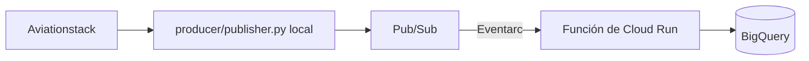

# Lab 04 — Aviationstack → Pub/Sub → Cloud Run → BigQuery

Laboratorio sencillo de datos de vuelos en tiempo casi real:



No necesitas crear un `Dockerfile`, construir una imagen ni administrar un
registro. En Cloud Run solamente se entregan estos dos archivos:

- `cloud_run/main.py`
- `cloud_run/requirements.txt`

Google administra el runtime Python 3.14 y la construcción interna necesaria
para ejecutar el código.

> [!IMPORTANT]
> El notebook del laboratorio original tiene una API key de Aviationstack en
> texto plano. Revócala y genera una nueva antes de continuar.

## Estructura sencilla

```text
lab04-aviationstack-pubsub-cloudrun-bigquery/
├── producer/
│   ├── .env.example        # Variables que debes copiar y reemplazar
│   ├── publisher.py        # Todo el producer en un archivo
│   └── requirements.txt
├── cloud_run/
│   ├── main.py             # Código que puedes pegar en Cloud Run
│   └── requirements.txt    # Dependencias que puedes pegar en Cloud Run
├── schema/create_table.sql # DDL de BigQuery
├── scripts/setup_gcp.sh
├── scripts/deploy_cloud_run.sh
└── tests/
```

## 1. Variables del producer

El archivo solicitado está en
[`producer/.env.example`](producer/.env.example). Cópialo:

```bash
cp producer/.env.example producer/.env
```

Abre `producer/.env` y reemplaza solamente estos dos valores obligatorios:

```dotenv
AVIATIONSTACK_API_KEY=REEMPLAZAR_CON_TU_API_KEY
GOOGLE_CLOUD_PROJECT=REEMPLAZAR_CON_TU_PROJECT_ID
```

El archivo completo contiene:

```dotenv
# OBLIGATORIO
AVIATIONSTACK_API_KEY=REEMPLAZAR_CON_TU_API_KEY
GOOGLE_CLOUD_PROJECT=REEMPLAZAR_CON_TU_PROJECT_ID

# OPCIONAL: puedes conservar estos valores
PUBSUB_TOPIC_ID=aviationstack-flights
AIRPORT_IATA=LIM
MOVEMENT_TYPE=ARRIVAL
FLIGHT_STATUS=active
AVIATIONSTACK_LIMIT=5
ONLY_LIVE_FLIGHTS=true
PUBLISH_INTERVAL_SECONDS=60
```

`MOVEMENT_TYPE` acepta `ARRIVAL` o `DEPARTURE`. Si tu plan de Aviationstack no
retorna el objeto `live`, cambia `ONLY_LIVE_FLIGHTS=false`.

## 2. Autenticarse en Google Cloud

```bash
gcloud auth login
gcloud auth application-default login

export GOOGLE_CLOUD_PROJECT="tu-project-id"
export GCP_REGION="us-central1"

gcloud auth application-default set-quota-project \
  "${GOOGLE_CLOUD_PROJECT}"
```

El producer usa Application Default Credentials. No descargues ni guardes una
llave JSON dentro del proyecto.

## 3. Crear Pub/Sub, BigQuery e IAM

```bash
./scripts/setup_gcp.sh
```

El script crea:

- topic `aviationstack-flights`;
- dataset `aviation_realtime`;
- tabla `flight_events`;
- cuenta de servicio que escribe en BigQuery;
- cuenta de servicio utilizada por Eventarc.

La tabla no se crea con un esquema JSON. El script ejecuta el DDL
[`schema/create_table.sql`](schema/create_table.sql), que contiene:

```sql
CREATE TABLE IF NOT EXISTS
  `{{PROJECT_ID}}.{{BIGQUERY_DATASET}}.{{BIGQUERY_TABLE}}`
(
  event_id STRING NOT NULL,
  collected_at TIMESTAMP NOT NULL,
  ingested_at TIMESTAMP NOT NULL,
  airport_iata STRING,
  flight_date DATE,
  flight_status STRING,
  flight_iata STRING,
  payload JSON
)
PARTITION BY flight_date
CLUSTER BY airport_iata, flight_status, flight_iata;
```

`setup_gcp.sh` reemplaza automáticamente los tres valores entre llaves antes de
ejecutar el DDL con `bq query`.

## 4A. Copiar el código directamente en Cloud Run

Esta es la opción visual que pediste:

1. Abre **Google Cloud Console → Cloud Run**.
2. Selecciona **Write a function / Escribir una función**.
3. Nombre: `aviation-to-bigquery`.
4. Región: `us-central1`.
5. Runtime/base: **Python 3.14**.
6. Autenticación: **Require authentication**.
7. Entry point: `process_flight`.
8. Variable de entorno:
   `BIGQUERY_TABLE_ID=tu-project-id.aviation_realtime.flight_events`.
9. Selecciona la cuenta de ejecución
   `aviation-bq-writer@tu-project-id.iam.gserviceaccount.com`.
10. En el editor, reemplaza `main.py` con el contenido de
    [`cloud_run/main.py`](cloud_run/main.py).
11. Reemplaza `requirements.txt` con el contenido de
    [`cloud_run/requirements.txt`](cloud_run/requirements.txt).
12. Despliega la función.

Después crea el trigger:

1. Abre la función desplegada y selecciona **Add Eventarc trigger**.
2. Proveedor: **Cloud Pub/Sub**.
3. Evento: `google.cloud.pubsub.topic.v1.messagePublished`.
4. Topic: `aviationstack-flights`.
5. Cuenta del trigger:
   `aviation-eventarc@tu-project-id.iam.gserviceaccount.com`.
6. Guarda el trigger.

## 4B. Alternativa mediante Google Cloud CLI

El mismo código fuente se puede desplegar sin Dockerfile:

```bash
./scripts/deploy_cloud_run.sh
```

El comando principal del script es:

```bash
gcloud run deploy aviation-to-bigquery \
  --source=cloud_run \
  --function=process_flight \
  --base-image=python314 \
  --region=us-central1 \
  --no-allow-unauthenticated
```

`--base-image=python314` selecciona el runtime administrado. No tienes que crear,
subir ni mantener una imagen propia.

## 5. Ejecutar el producer local

```bash
python3 -m venv .venv
source .venv/bin/activate
python -m pip install -r producer/requirements.txt
python producer/publisher.py
```

Ese comando consulta Aviationstack una vez y termina. Para consultar cada 60
segundos hasta presionar `Ctrl+C`:

```bash
python producer/publisher.py --continuous
```

## 6. Consultar BigQuery

```bash
bq query --use_legacy_sql=false \
  "SELECT flight_iata, departure_iata, arrival_iata, flight_status, ingested_at
   FROM \`${GOOGLE_CLOUD_PROJECT}.aviation_realtime.flight_events\`
   ORDER BY ingested_at DESC
   LIMIT 20"
```

## Pruebas

```bash
python -m pip install -r cloud_run/requirements.txt
python -m unittest discover -s tests -v
```

## Referencias oficiales

- [Escribir funciones de Cloud Run desde código fuente](https://cloud.google.com/run/docs/write-functions)
- [Desplegar una función Python de Cloud Run](https://cloud.google.com/run/docs/quickstarts/functions/deploy-functions-gcloud)
- [Crear triggers Pub/Sub para Cloud Run](https://cloud.google.com/run/docs/triggering/pubsub-triggers)
- [Publicar mensajes con Pub/Sub](https://cloud.google.com/pubsub/docs/publisher)
- [Streaming inserts de BigQuery](https://cloud.google.com/bigquery/docs/streaming-data-into-bigquery)
