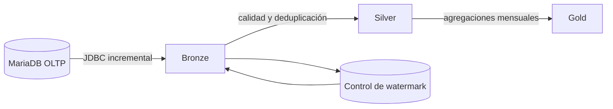

# Reto — Pipeline bancario Bronze, Silver y Gold

Construye un pipeline batch incremental con Spark usando
`u845286110_labs` como fuente OLTP. La solución no debe ejecutar consultas
analíticas pesadas directamente sobre MariaDB.

## Arquitectura objetivo



## Bronze

Realiza una carga completa de las seis tablas maestras y una carga incremental
de `banco_transaccion`.

Usa un cursor compuesto para no perder filas con el mismo timestamp:

```sql
SELECT *
FROM banco_transaccion
WHERE fecha_transaccion > :ultima_fecha
   OR (
     fecha_transaccion = :ultima_fecha
     AND id_transaccion > :ultimo_id
   )
ORDER BY fecha_transaccion, id_transaccion;
```

Añade metadatos técnicos como `ingestion_timestamp`, `source_system` y
`batch_id`. Conserva los datos de origen sin aplicar reglas de negocio.

Para la primera carga de 50,060 movimientos, paraleliza el JDBC por
`id_transaccion`, pero limita las conexiones para no afectar el OLTP.

## Silver

Construye las siguientes tablas:

- `silver_cliente`
- `silver_cuenta`
- `silver_tarjeta`
- `silver_prestamo`
- `silver_transaccion`

Reglas mínimas:

1. Deduplicar transacciones por `id_transaccion` y `codigo_operacion`.
2. Convertir créditos a monto positivo y débitos a monto negativo.
3. Excluir operaciones rechazadas de las métricas financieras, pero conservarlas
   para indicadores de calidad y fraude.
4. Validar moneda, importe, fecha, cuenta y canal.
5. Separar registros inválidos en una tabla de cuarentena.
6. No sumar PEN y USD sin una tabla de tipo de cambio.

## Gold

Crea al menos estos productos de datos:

### `gold_resumen_transaccional_mensual`

Grano: mes, moneda, canal y tipo de transacción.

Métricas:

- cantidad de operaciones;
- clientes y cuentas activas;
- monto total;
- ticket promedio;
- porcentaje de operaciones rechazadas y reversadas;
- variación frente al mes anterior.

### `gold_cliente_360`

Grano: un cliente.

Métricas:

- cuentas activas por moneda;
- saldo actual por moneda;
- tarjetas activas y línea de crédito;
- deuda pendiente y cantidad de préstamos;
- última fecha transaccional;
- operaciones y monto de los últimos 30, 90 y 365 días.

### `gold_cartera_prestamos`

Grano: mes, sucursal, tipo de préstamo y estado.

Métricas:

- monto desembolsado;
- saldo pendiente;
- porcentaje pendiente;
- cantidad de clientes;
- préstamos vencidos.

## Pruebas de aceptación

- Bronze contiene exactamente 50,060 transacciones tras la carga inicial.
- Una segunda ejecución sin datos nuevos inserta cero filas.
- No existen duplicados por `id_transaccion` o `codigo_operacion` en Silver.
- La historia generada cubre 24 meses y 730 fechas diferentes.
- Cada mes histórico tiene cinco canales y seis tipos de transacción.
- Gold nunca mezcla PEN con USD.
- Los totales mensuales pueden reconciliarse con Silver.
- Un fallo antes de actualizar el watermark puede reintentarse sin duplicar datos.
