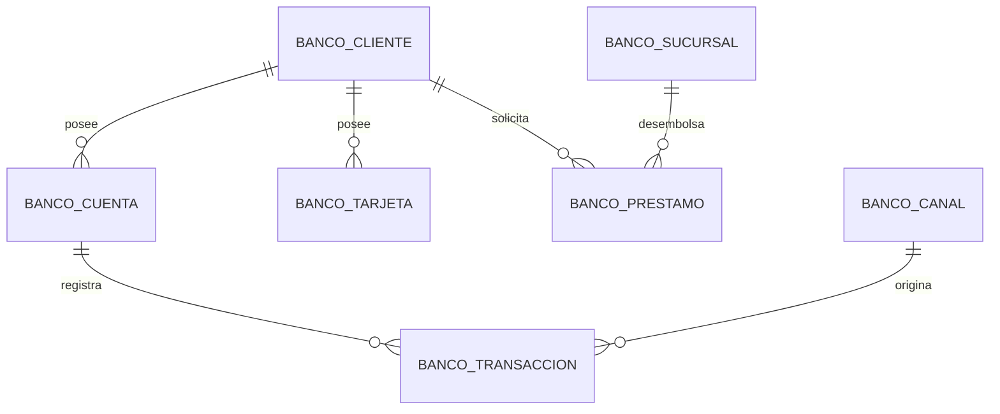

# Lab 05 — Fuente OLTP bancaria con MySQL

Este ejercicio convierte el modelo de la captura en una base operacional
bancaria reproducible. El objetivo es comprender la fuente antes de construir
un modelo analítico o ingerir sus datos con Spark.

Base configurada para esta implementación: `u845286110_labs`.

Todas las tablas de esta fuente usan la convención `banco_<entidad>`. El prefijo
permite distinguir el caso bancario de otros laboratorios que compartan la misma
base de datos.

## Contexto del negocio

Somos un banco retail que atiende personas y empresas. El sistema registra:

- clientes naturales y jurídicos;
- cuentas de ahorro, corrientes y de plazo fijo;
- depósitos, retiros, transferencias, compras, pagos y comisiones;
- préstamos de consumo, vehiculares, hipotecarios y empresariales;
- tarjetas de débito y crédito;
- sucursales y canales presenciales o digitales.

## Modelo relacional



La captura parecía conectar `sucursal` con `tarjeta`, pero `tarjeta` no contenía
una clave `id_sucursal`. En este modelo se conserva la relación coherente
`cliente 1:N tarjeta`.

## Estructura

```text
lab05-mysql-oltp-bancario/
├── README.md
├── PIPELINE_CHALLENGE.md
└── sql/
    ├── 01_create_database.sql
    ├── 02_create_tables.sql
    ├── 03_seed_data.sql
    ├── 04_generate_two_year_history.sql
    ├── 05_validate_data.sql
    └── 06_solutions.sql
```

## Requisitos

- MySQL 8.0.16 o superior o MariaDB 11.
- Un usuario con permisos para crear una base de datos y tablas.
- MySQL CLI, MySQL Shell o MySQL Workbench.

El ejercicio incluye restricciones `CHECK`, expresiones de tabla comunes y
funciones de ventana. El servidor configurado para este laboratorio se identifica
como MariaDB 11.8 y el DDL se mantiene compatible también con MySQL 8.

## Crear y poblar la base

Desde la carpeta `lab05-mysql-oltp-bancario`:

```bash
mysql -u root -p < sql/01_create_database.sql
mysql -u root -p < sql/02_create_tables.sql
mysql -u root -p < sql/03_seed_data.sql
mysql -u root -p < sql/04_generate_two_year_history.sql
mysql -u root -p < sql/05_validate_data.sql
```

En MySQL Workbench, abre y ejecuta los archivos en el mismo orden.

En el servidor remoto usado durante la creación, `u845286110_labs` ya existía;
por ello se ejecutaron directamente el DDL de tablas y la carga de datos. El
archivo `01_create_database.sql` se conserva para instalaciones locales nuevas.

La carga semilla y el generador histórico deben ejecutarse una sola vez sobre
tablas vacías. Ambos están agrupados dentro de transacciones.

## Datos disponibles

| Tabla | Propósito | Filas totales |
|---|---|---:|
| `banco_cliente` | Personas y empresas atendidas | 515 |
| `banco_cuenta` | Cuentas y saldo operacional actual | 822 |
| `banco_transaccion` | Movimientos monetarios | 50,060 |
| `banco_canal` | Ventanilla, ATM, web, móvil y POS | 5 |
| `banco_prestamo` | Colocaciones y deuda pendiente | 190 |
| `banco_sucursal` | Puntos de atención | 6 |
| `banco_tarjeta` | Tarjetas emitidas | 414 |

La historia generada contiene 50,000 operaciones distribuidas sin días vacíos
entre el 1 de septiembre de 2024 y el 31 de agosto de 2026: 24 meses completos.
Las 60 operaciones iniciales añaden ejemplos de agosto y septiembre de 2026.
Existen operaciones aprobadas, rechazadas y reversadas para practicar reglas de
calidad, reintentos y filtros de negocio.

## Decisiones del modelo

- Todas las tablas usan InnoDB y claves foráneas con borrado restringido.
- Los importes monetarios usan `DECIMAL`; no se usa `FLOAT` para dinero.
- PEN y USD se almacenan por separado. Las consultas no deben sumar monedas sin
  aplicar antes un tipo de cambio.
- Las transacciones guardan `monto` positivo y una `naturaleza` que indica
  crédito o débito.
- Se guarda únicamente un número de tarjeta enmascarado. Nunca se almacena un
  PAN real en este laboratorio.
- Los índices acompañan las relaciones y los filtros frecuentes por fecha,
  estado, canal y cliente.

## Ejercicios

Resuelve las siguientes preguntas antes de abrir `sql/06_solutions.sql`:

1. ¿Cuántos clientes activos existen por segmento y tipo de cliente?
2. ¿Cuál es el saldo total y promedio por tipo de cuenta y moneda?
3. ¿Qué canal procesó más transacciones aprobadas durante agosto de 2026?
4. ¿Qué clientes activos no tuvieron movimientos durante los 15 días anteriores
   al último dato disponible?
5. Calcula el movimiento neto por cuenta: créditos menos débitos.
6. Obtén los cinco clientes con mayor saldo en PEN y los cinco con mayor saldo
   en USD sin mezclar monedas.
7. ¿Qué sucursal tiene el mayor saldo pendiente de préstamos?
8. Construye una vista 360 por cliente con cantidad de cuentas, tarjetas,
   préstamos y deuda pendiente. Evita duplicar métricas por joins 1:N.
9. Identifica operaciones iguales o mayores a 50,000 que deberían revisarse.
10. Calcula el movimiento acumulado de cada cuenta con una función de ventana.
11. Construye indicadores mensuales por moneda: operaciones, cuentas activas,
    monto movilizado y ticket promedio.
12. Calcula la variación porcentual de transacciones frente al mes anterior.
13. Calcula clientes transaccionalmente activos por mes y segmento.

Las respuestas de referencia están en
[`sql/06_solutions.sql`](sql/06_solutions.sql).

## Validaciones esperadas

Al ejecutar `sql/05_validate_data.sql` debes obtener:

- las cantidades de la tabla anterior;
- cero cuentas sin cliente;
- cero transacciones sin cuenta o canal;
- cero saldos negativos;
- cero préstamos cuyo saldo supere el desembolso;
- cero tarjetas de débito con línea de crédito;
- cero tarjetas de crédito sin línea de crédito;
- 24 meses completos y 730 días distintos en la historia generada;
- los cinco canales y seis tipos de transacción presentes cada mes.

## Siguiente reto con Spark

Usa esta base como fuente JDBC y crea una ingesta incremental basada en:

- `banco_transaccion.id_transaccion` como cursor creciente; o
- `banco_transaccion.fecha_transaccion` más `id_transaccion` como cursor
  compuesto.

Después construye capas Bronze, Silver y Gold para responder las trece preguntas
del ejercicio sin consultar directamente el OLTP.

La especificación completa del pipeline está en
[`PIPELINE_CHALLENGE.md`](PIPELINE_CHALLENGE.md).
