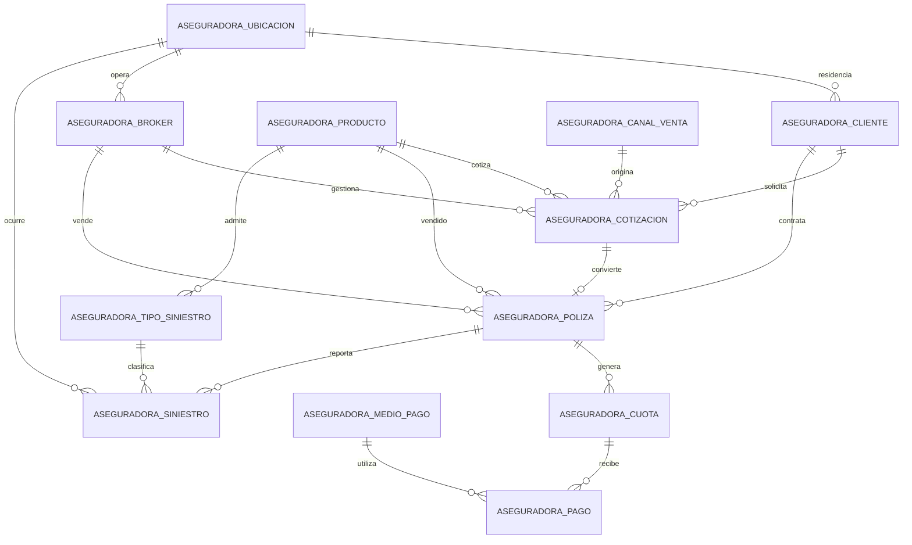

# Lab 06 — Comercialización de seguros voluntarios con MySQL

Este laboratorio representa el frente comercial de una aseguradora: clientes,
ubicación, brokers, cotizaciones, pólizas, cuotas, pagos y siniestros. El modelo
evita procesos actuariales o clínicos avanzados para mantener el ejercicio
enfocado en analítica comercial y construcción de pipelines.

La implementación remota usa la base configurada en `MYSQL_DATABASE`. Todas las
tablas llevan el prefijo `aseguradora_`, por lo que pueden convivir con las
tablas `banco_` del Lab 05 dentro de la misma base.

## Alcance

- catálogo de productos voluntarios publicados por La Positiva;
- embudo de cotizaciones y conversión a pólizas;
- ventas nuevas y renovaciones;
- brokers, canales, metas y comisiones;
- cronograma de cuotas, pagos y morosidad;
- clientes y distribución geográfica;
- siniestros, reservas e indemnizaciones;
- frecuencia, severidad y siniestralidad comercial.

El SOAT, Vida Ley, SCTR y los seguros obligatorios están fuera del alcance.

## Uso educativo del catálogo

Los nombres comerciales, familias, descripciones resumidas, códigos SBS cuando
están visibles y URLs proceden del sitio público de La Positiva consultado el
3 de septiembre de 2026. Las primas, clientes, brokers, cotizaciones, pólizas,
pagos y siniestros son completamente sintéticos.

Este repositorio es un ejercicio independiente y no está afiliado, patrocinado
ni validado por La Positiva. Las condiciones contractuales oficiales siempre
prevalecen sobre este material.

Fuentes del catálogo:

- [Seguros vehiculares](https://www.lapositiva.com.pe/wps/portal/corporativo/home/proteger/mi-vehiculo/seguros-vehiculares)
- [Seguros domiciliarios](https://www.lapositiva.com.pe/wps/portal/corporativo/home/proteger/mis-bienes/seguros-hogar)
- [Seguros contra accidentes](https://www.lapositiva.com.pe/wps/portal/corporativo/home/proteger/mi-salud/seguros-contra-accidentes)
- [Seguros oncológicos](https://www.lapositiva.com.pe/wps/portal/corporativo/home/proteger/mi-salud/seguros-salud-oncologicos)
- [Seguros de vida y ahorro](https://www.lapositiva.com.pe/wps/portal/corporativo/home/proteger/mi-futuro/seguros-vida-ahorro)
- [Seguros de viaje internacional](https://www.lapositiva.com.pe/wps/portal/corporativo/home/proteger/mi-viaje/seguros-viaje-internacional)

## Modelo entidad-relación



## Las 12 tablas

| Tabla | Propósito |
|---|---|
| `aseguradora_ubicacion` | Ubigeos de clientes, brokers y siniestros |
| `aseguradora_cliente` | Personas que cotizan o contratan |
| `aseguradora_producto` | Catálogo comercial real y metadatos de fuente |
| `aseguradora_broker` | Corredores y asesores comerciales sintéticos |
| `aseguradora_canal_venta` | Broker, web, app, call center, oficina y alianza |
| `aseguradora_medio_pago` | Medios usados para cobrar cuotas |
| `aseguradora_cotizacion` | Oportunidades y resultado del embudo |
| `aseguradora_poliza` | Venta emitida, prima, comisión y vigencia |
| `aseguradora_cuota` | Cronograma y saldo por cobrar |
| `aseguradora_pago` | Intentos de pago procesados o rechazados |
| `aseguradora_tipo_siniestro` | Clasificación por producto |
| `aseguradora_siniestro` | Reclamo, reserva, aprobación y pago |

Para simplificar, `aseguradora_poliza.referencia_riesgo` identifica de manera
didáctica el vehículo, inmueble, persona o viaje. Un sistema asegurador completo
usaría tablas especializadas para cada riesgo.

## Datos desplegados

El despliegue validado en MariaDB 11.8 contiene:

| Tabla | Filas |
|---|---:|
| `aseguradora_ubicacion` | 30 |
| `aseguradora_producto` | 10 |
| `aseguradora_broker` | 120 |
| `aseguradora_canal_venta` | 6 |
| `aseguradora_medio_pago` | 6 |
| `aseguradora_cliente` | 12,000 |
| `aseguradora_cotizacion` | 36,000 |
| `aseguradora_poliza` | 23,040 |
| `aseguradora_cuota` | 175,680 |
| `aseguradora_pago` | 133,724 |
| `aseguradora_tipo_siniestro` | 26 |
| `aseguradora_siniestro` | 4,000 |

Las cotizaciones abarcan los 730 días comprendidos entre el 1 de septiembre de
2024 y el 31 de agosto de 2026. El promedio mensual es de 1,500 cotizaciones y
960 pólizas emitidas.

## Estructura

```text
lab06-mysql-oltp-seguros-voluntarios-la-positiva/
├── README.md
├── PIPELINE_CHALLENGE.md
├── lab06-mysql.env.example
├── requirements.txt
├── scripts/
│   ├── deploy_mysql.py
│   └── validate_mysql.py
└── sql/
    ├── 01_create_database.sql
    ├── 02_create_tables.sql
    ├── 03_seed_catalogs.sql
    ├── 04_generate_two_year_history.sql
    ├── 05_validate_data.sql
    └── 06_solutions.sql
```

## Ejecución

Con MySQL CLI, ejecuta una sola vez y en este orden:

```bash
mysql -h "$MYSQL_HOST" -P "$MYSQL_PORT" -u "$MYSQL_USER" -p \
  "$MYSQL_DATABASE" < sql/02_create_tables.sql
mysql -h "$MYSQL_HOST" -P "$MYSQL_PORT" -u "$MYSQL_USER" -p \
  "$MYSQL_DATABASE" < sql/03_seed_catalogs.sql
mysql -h "$MYSQL_HOST" -P "$MYSQL_PORT" -u "$MYSQL_USER" -p \
  "$MYSQL_DATABASE" < sql/04_generate_two_year_history.sql
mysql -h "$MYSQL_HOST" -P "$MYSQL_PORT" -u "$MYSQL_USER" -p \
  "$MYSQL_DATABASE" < sql/05_validate_data.sql
```

Para una instalación local nueva puede ejecutarse primero
`sql/01_create_database.sql`. En un hosting cuya base ya existe, omite ese
archivo y utiliza el nombre asignado por el proveedor.

Requisitos: MySQL 8.0.16 o superior, o MariaDB 11. La generación histórica es
determinística, se ejecuta sobre tablas vacías y cubre del 1 de septiembre de
2024 al 31 de agosto de 2026.

También puedes desplegar los tres archivos principales con Python:

```bash
python3 -m venv .venv
.venv/bin/pip install -r requirements.txt
cp lab06-mysql.env.example lab06-mysql.env
# Reemplaza los valores de lab06-mysql.env antes de continuar.
.venv/bin/python scripts/deploy_mysql.py --env-file lab06-mysql.env
.venv/bin/python scripts/validate_mysql.py --env-file lab06-mysql.env
```

## Preguntas del ejercicio

1. ¿Cuánto se cotizó y vendió por mes?
2. ¿Qué canales convierten mejor las cotizaciones?
3. ¿Qué productos generan mayor prima emitida?
4. ¿Qué brokers venden más y cuánto comisionan?
5. ¿Qué brokers combinan buenas ventas, cobranza y baja siniestralidad?
6. ¿Dónde se concentran los clientes y las ventas?
7. ¿Cuál es la deuda vencida y la tasa de morosidad?
8. ¿Qué medios de pago concentran la cobranza?
9. ¿Cuál es la frecuencia, severidad y siniestralidad por producto?
10. ¿Dónde ocurren más siniestros y cuál es su costo?
11. ¿Qué clientes compraron más de un producto?
12. ¿Cómo evolucionan las renovaciones?

Las respuestas de referencia están en `sql/06_solutions.sql`.

## Siguiente etapa

El reto posterior consiste en copiar estas tablas hacia Microsoft Fabric,
crear capas Bronze, Silver y Gold y producir un tablero comercial. La propuesta
está en `PIPELINE_CHALLENGE.md`.
