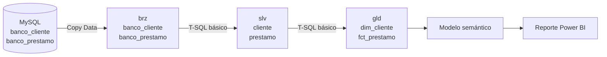

# Lab 07 — MySQL a Microsoft Fabric Warehouse y Power BI

Laboratorio introductorio para construir un flujo completo con solamente dos
entidades directamente relacionadas:

- `banco_cliente`: describe al cliente;
- `banco_prestamo`: representa las colocaciones del banco.

La relación es directa:

```text
banco_cliente.id_cliente 1 ─────── N banco_prestamo.id_cliente
```

No se usa `banco_transaccion` porque necesita pasar por `banco_cuenta` para
llegar al cliente. Para un curso inicial, `banco_prestamo` permite explicar un
caso comercial más simple: quiénes son los clientes, qué préstamos contrataron,
cuánto se desembolsó y cuánto queda pendiente.

## Arquitectura

Todo se crea dentro de un mismo workspace y de un único Warehouse:



## Nombres que se utilizarán

| Artefacto | Nombre |
|---|---|
| Workspace | `wk_banca_dev` |
| Warehouse | `wh_banca_dev_comercial` |
| Pipeline | `pl_banca_dev_clientes_prestamos` |
| Modelo semántico | `sm_banca_dev_clientes_prestamos` |
| Reporte | `rpt_banca_dev_clientes_prestamos` |
| Schemas | `brz`, `slv`, `gld` |

## Dos tablas por capa

| Capa | Tabla de clientes | Tabla comercial |
|---|---|---|
| MySQL | `banco_cliente` | `banco_prestamo` |
| Bronze | `brz.banco_cliente` | `brz.banco_prestamo` |
| Silver | `slv.cliente` | `slv.prestamo` |
| Gold | `gld.dim_cliente` | `gld.fct_prestamo` |

## Qué se aprende

1. Crear un Warehouse y schemas en Microsoft Fabric.
2. Usar Copy Data con el conector MySQL.
3. Copiar dos tablas sin joins ni transformaciones complejas.
4. Limpiar texto y validar registros en Silver.
5. Construir una dimensión y una tabla de hechos en Gold.
6. Crear una relación `1:*` en el modelo semántico.
7. Crear medidas DAX y un reporte básico en Power BI.

Empieza con la [guía paso a paso](GUIA_PASO_A_PASO.md). Para entregarlo como
práctica, comparte primero el [enunciado](ENUNCIADO.md).

## Estructura

```text
lab07-fabric-warehouse-clientes-prestamos/
├── README.md
├── ENUNCIADO.md
├── GUIA_PASO_A_PASO.md
├── NOMENCLATURA.md
├── pipeline/
│   └── CONFIGURACION_COPY_DATA.md
├── powerbi/
│   ├── 01_MODELO_SEMANTICO.md
│   ├── 02_MEDIDAS_DAX.md
│   └── 03_DASHBOARD_BASICO.md
└── sql/
    ├── mysql/
    │   └── 01_validar_origen.sql
    └── fabric/
        ├── 01_crear_schemas.sql
        ├── 02_crear_tablas_bronze.sql
        ├── 03_crear_tablas_silver.sql
        ├── 04_crear_tablas_gold.sql
        ├── 05_limpiar_bronze.sql
        ├── 06_cargar_silver.sql
        ├── 07_cargar_gold.sql
        └── 08_validar_capas.sql
```

## Resultado esperado

Al finalizar tendrás un reporte con:

- cantidad de clientes;
- clientes con préstamos;
- cantidad de préstamos;
- monto desembolsado;
- saldo pendiente;
- porcentaje pagado;
- préstamos por tipo, segmento, estado y mes;
- detalle básico por cliente.

Microsoft Fabric admite schemas personalizados y tablas dimensionales en
Warehouse. El conector MySQL admite Copy activity como origen. Desde septiembre
de 2025 el modelo semántico ya no se crea automáticamente, por lo que este
laboratorio incluye expresamente ese paso.

Referencias oficiales:

- [Tablas y schemas en Fabric Warehouse](https://learn.microsoft.com/en-us/fabric/data-warehouse/tables)
- [Conector MySQL de Fabric Data Factory](https://learn.microsoft.com/en-us/fabric/data-factory/connector-mysql-database-overview)
- [Crear un modelo semántico desde un Warehouse](https://learn.microsoft.com/en-us/fabric/data-warehouse/create-semantic-model)
