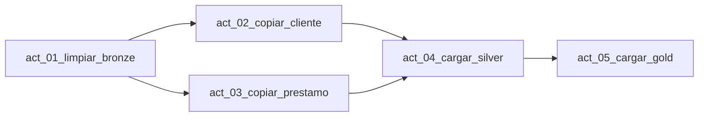

# Configuración del pipeline

Nombre:

```text
pl_banca_dev_clientes_prestamos
```

## Diseño



## Actividad 1 — Limpiar Bronze

| Propiedad | Valor |
|---|---|
| Nombre | `act_01_limpiar_bronze` |
| Tipo | Script |
| Conexión | `wh_banca_dev_comercial` |
| Script | `sql/fabric/05_limpiar_bronze.sql` |

## Actividad 2 — Copiar clientes

| Propiedad | Valor |
|---|---|
| Nombre | `act_02_copiar_cliente` |
| Tipo | Copy Data |
| Source connection | MySQL del Lab 05 |
| Use query | Table |
| Source table | `banco_cliente` |
| Destination | Warehouse |
| Destination table | `brz.banco_cliente` |
| Table action | Append |

En **Mapping**, selecciona **Import schemas**. Los nombres deben coincidir uno a
uno; no agregues columnas ni transformaciones.

## Actividad 3 — Copiar préstamos

| Propiedad | Valor |
|---|---|
| Nombre | `act_03_copiar_prestamo` |
| Tipo | Copy Data |
| Source connection | MySQL del Lab 05 |
| Use query | Table |
| Source table | `banco_prestamo` |
| Destination | Warehouse |
| Destination table | `brz.banco_prestamo` |
| Table action | Append |

Selecciona **Import schemas** en Mapping. Esta copia tampoco necesita consulta
SQL ni join.

## Actividad 4 — Cargar Silver

| Propiedad | Valor |
|---|---|
| Nombre | `act_04_cargar_silver` |
| Tipo | Script |
| Conexión | `wh_banca_dev_comercial` |
| Script | `sql/fabric/06_cargar_silver.sql` |

Agrega dos dependencias **On success**, una desde cada actividad Copy Data.

## Actividad 5 — Cargar Gold

| Propiedad | Valor |
|---|---|
| Nombre | `act_05_cargar_gold` |
| Tipo | Script |
| Conexión | `wh_banca_dev_comercial` |
| Script | `sql/fabric/07_cargar_gold.sql` |

Esta actividad depende de `act_04_cargar_silver` con **On success**.

## Forma de carga

El laboratorio usa **full refresh**:

1. vacía Bronze;
2. copia ambas tablas completas;
3. reemplaza Silver;
4. reemplaza Gold.

Es intencionalmente sencillo. Una futura versión puede incorporar watermarks e
ingesta incremental.
