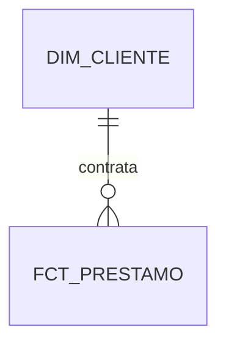

# Modelo semántico

## Crear el modelo

1. Abre `wh_banca_dev_comercial`.
2. Selecciona **New semantic model**.
3. Escribe `sm_banca_dev_clientes_prestamos`.
4. Expande el schema `gld`.
5. Selecciona `dim_cliente` y `fct_prestamo`.
6. Selecciona **Confirm**.

Fabric ya no crea automáticamente un modelo semántico para cada Warehouse; debe
crearse explícitamente.

## Crear la relación

En **Open data model**, crea esta relación:

```text
dim_cliente[id_cliente] 1 ─────── * fct_prestamo[id_cliente]
```

Configuración:

| Propiedad | Valor |
|---|---|
| Cardinalidad | Uno a varios `1:*` |
| Dirección del filtro | Single |
| Tabla que filtra | `dim_cliente` |
| Relación activa | Sí |

## Modelo final



Después crea las medidas de
[`02_MEDIDAS_DAX.md`](02_MEDIDAS_DAX.md).
