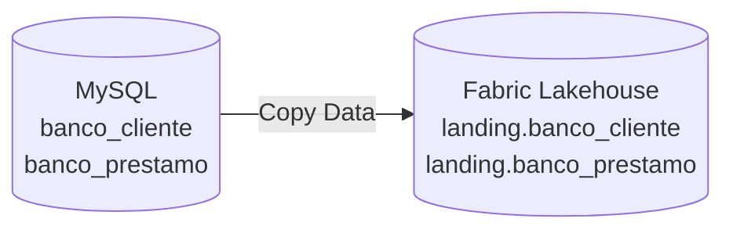

# Lab 08 — Fabric 02: landing en Lakehouse con tablas Delta

Ejercicio complementario del Lab 07 para comparar dos formas de implementar la
primera capa de una arquitectura medallion en Microsoft Fabric.

En el Lab 07, Bronze se implementa dentro de un **Warehouse** con tablas
T-SQL. En este ejercicio, las mismas entidades de negocio se crean en un
**Lakehouse** como tablas administradas en formato **Delta Lake**.

## Alcance

Se trabajará únicamente con dos tablas del origen bancario MySQL:

- `banco_cliente`;
- `banco_prestamo`.

La capa se llamará `landing`. En este ejercicio, landing cumple la función de
Bronze: recibe todas las columnas como `STRING`, sin aplicar conversiones de
tipo, reglas de negocio, deduplicación ni transformaciones hacia Silver o Gold.



## Artefactos sugeridos

| Artefacto | Nombre |
|---|---|
| Workspace | `wk_banca_dev` |
| Lakehouse | `lh_banca_dev_landing` |
| Schema | `landing` |
| Notebook o consulta Spark SQL | `nb_banca_dev_ddl_landing` |

El Lakehouse debe crearse con **Lakehouse schemas** habilitado para poder usar
el namespace `landing.tabla`.

## Archivos del ejercicio

```text
lab08-fabric-lakehouse-landing-clientes-prestamos/
├── README.md
├── ENUNCIADO.md
└── sql/
    └── fabric/
        └── 01_crear_tablas_landing_delta.sql
```

- Entrega al estudiante: [ENUNCIADO.md](ENUNCIADO.md).
- DDL de referencia: [01_crear_tablas_landing_delta.sql](sql/fabric/01_crear_tablas_landing_delta.sql).

## Cómo ejecutar el DDL

1. En el workspace de Fabric, crea `lh_banca_dev_landing` y conserva activada
   la opción **Lakehouse schemas**.
2. Abre el Lakehouse y crea una consulta **Spark SQL**, o crea un notebook con
   el Lakehouse adjunto y selecciona Spark SQL como lenguaje de la celda.
3. Ejecuta `01_crear_tablas_landing_delta.sql`.
4. Actualiza el explorador del Lakehouse y comprueba que ambas tablas aparezcan
   dentro del schema `landing`.

> El DDL no debe ejecutarse en el SQL analytics endpoint. Ese endpoint permite
> consultar las tablas Delta con T-SQL, pero la creación de estas tablas en el
> ejercicio se realiza con Spark SQL.

## Diferencias que debe observar el estudiante

| Warehouse del Lab 07 | Lakehouse de este ejercicio |
|---|---|
| DDL con T-SQL | DDL con Spark SQL |
| Tipos definidos según el negocio | Todas las columnas como `STRING` en landing |
| Tabla administrada por Warehouse | Tabla administrada Delta en OneLake |
| Schema `brz` | Schema `landing` |

`USING DELTA` se incluye de forma explícita con fines didácticos. Delta es el
formato de tabla predeterminado del Lakehouse de Fabric, pero escribirlo permite
reconocer claramente la tecnología utilizada.

## Resultado esperado

```text
lh_banca_dev_landing
└── Tables
    └── landing
        ├── banco_cliente
        └── banco_prestamo
```

Las tablas quedan vacías después del DDL y preparadas para una carga posterior
con Copy Data. No se crean claves primarias, claves foráneas ni índices. Todos
los valores se reciben como texto; la conversión a números, fechas y timestamps,
así como la evaluación de calidad, se realizará en Silver.

## Referencias oficiales

- [Lakehouse y tablas Delta en Microsoft Fabric](https://learn.microsoft.com/en-us/fabric/data-engineering/lakehouse-and-delta-tables)
- [Schemas en un Lakehouse](https://learn.microsoft.com/en-us/fabric/data-engineering/lakehouse-schemas)
- [Explorador de consultas Spark SQL](https://learn.microsoft.com/en-us/fabric/data-engineering/lakehouse-query-explorer)
