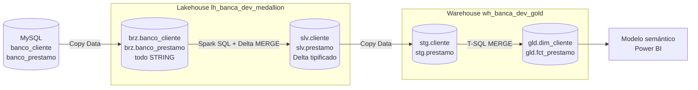

# Lab 08 — Fabric 02: Lakehouse Bronze/Silver y Warehouse Gold

Laboratorio para construir una arquitectura medallion híbrida en Microsoft
Fabric con dos entidades bancarias:

- `banco_cliente`;
- `banco_prestamo`.

Bronze y Silver se implementan como tablas Delta dentro de un Lakehouse. Silver
mantiene el historial de cambios del cliente mediante **Slowly Changing
Dimension Type 2 (SCD Tipo 2)**. Gold se implementa como un modelo estrella en
un Warehouse separado.

## Arquitectura



## Responsabilidad de cada capa

| Capa | Motor | Objetivo |
|---|---|---|
| Bronze | Lakehouse / Delta | Recibir el snapshot de MySQL con todas las columnas `STRING` |
| Silver | Lakehouse / Delta | Tipificar, normalizar, deduplicar y conservar historia SCD2 |
| Staging | Warehouse | Recibir el snapshot tipificado de Silver |
| Gold | Warehouse | Publicar `dim_cliente` y `fct_prestamo` para análisis |

## SCD Tipo 2 utilizado

La clave de negocio es `id_cliente`. Silver calcula `hash_atributos` con los
atributos descriptivos del cliente y compara el hash entrante con la versión
actual.

Cuando aparece un cliente nuevo:

- inserta una fila con `es_actual = true`;
- asigna `vigente_desde` con la fecha del proceso;
- asigna `vigente_hasta = 9999-12-31`.

Cuando cambian sus atributos:

- cierra la versión anterior con `es_actual = false`;
- actualiza `vigente_hasta`;
- inserta una nueva versión con otro `cliente_sk`.

Una nueva ejecución sin cambios no genera versiones duplicadas. El tratamiento
de eliminaciones físicas del origen queda fuera del alcance; los cambios de
estado sí generan una nueva versión.

## Nombres sugeridos

| Artefacto | Nombre |
|---|---|
| Workspace | `wk_banca_dev` |
| Lakehouse | `lh_banca_dev_medallion` |
| Warehouse | `wh_banca_dev_gold` |
| Pipeline | `pl_banca_dev_lakehouse_warehouse` |
| Modelo semántico | `sm_banca_dev_clientes_prestamos_lh` |
| Reporte | `rpt_banca_dev_clientes_prestamos_lh` |

## Tablas creadas

| Capa | Clientes | Préstamos |
|---|---|---|
| MySQL | `banco_cliente` | `banco_prestamo` |
| Bronze Delta | `brz.banco_cliente` | `brz.banco_prestamo` |
| Silver Delta | `slv.cliente` | `slv.prestamo` |
| Warehouse staging | `stg.cliente` | `stg.prestamo` |
| Warehouse Gold | `gld.dim_cliente` | `gld.fct_prestamo` |

## Estructura

```text
lab08-fabric-lakehouse-landing-clientes-prestamos/
├── README.md
├── ENUNCIADO.md
├── GUIA_PASO_A_PASO.md
├── pipeline/
│   └── CONFIGURACION_PIPELINE.md
└── sql/
    ├── lakehouse/
    │   ├── 01_crear_tablas_bronze_silver.sql
    │   ├── 02_limpiar_bronze.sql
    │   ├── 03_cargar_silver.sql
    │   └── 04_validar_lakehouse.sql
    └── warehouse/
        ├── 01_crear_staging_gold.sql
        ├── 02_limpiar_staging.sql
        ├── 03_cargar_gold.sql
        └── 04_validar_gold.sql
```

## Orden de trabajo

1. Lee el [enunciado](ENUNCIADO.md).
2. Crea el Lakehouse y el Warehouse.
3. Ejecuta los DDL de Lakehouse y Warehouse una sola vez.
4. Configura el pipeline con la
   [guía de actividades](pipeline/CONFIGURACION_PIPELINE.md).
5. Ejecuta el pipeline una primera vez.
6. Modifica el segmento, estado, email o teléfono de un cliente en MySQL.
7. Ejecuta el pipeline nuevamente para demostrar SCD Tipo 2.
8. Ejecuta las validaciones y revisa las dos versiones del cliente modificado.

La [guía paso a paso](GUIA_PASO_A_PASO.md) contiene el procedimiento completo.

## Decisión sobre la tabla de hechos

Cuando se incorpora un préstamo nuevo a Gold, se asigna el `cliente_sk` de la
versión vigente del cliente. Si después cambia el cliente, el préstamo ya
existente conserva su clave histórica. Los saldos y el estado del préstamo sí
se actualizan porque `slv.prestamo` utiliza comportamiento Tipo 1.

## Referencias oficiales

- [Lakehouse y tablas Delta](https://learn.microsoft.com/en-us/fabric/data-engineering/lakehouse-and-delta-tables)
- [Schemas en un Lakehouse](https://learn.microsoft.com/en-us/fabric/data-engineering/lakehouse-schemas)
- [Control de concurrencia y MERGE de Delta](https://learn.microsoft.com/en-us/fabric/data-engineering/delta-lake-concurrency-control)
- [Copy Activity para Lakehouse](https://learn.microsoft.com/en-us/fabric/data-factory/connector-lakehouse-copy-activity)
- [Superficie T-SQL de Fabric Warehouse](https://learn.microsoft.com/en-us/fabric/data-warehouse/tsql-surface-area)
