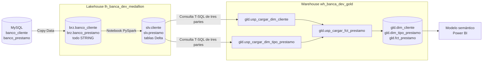

# Lab 08 — Fabric 02: Lakehouse con PySpark y Warehouse Gold

Laboratorio didáctico para construir una arquitectura medallion híbrida en
Microsoft Fabric usando únicamente `banco_cliente` y `banco_prestamo`.

- La metadata de Bronze y Silver se crea con DDL de Spark SQL.
- La transformación Bronze → Silver se realiza con un notebook PySpark sencillo.
- Silver conserva el historial de clientes con SCD Tipo 2.
- Gold se carga con procedimientos almacenados de Fabric Warehouse.
- Los procedimientos leen directamente las tablas Delta de Silver.

## Arquitectura



No se necesita una zona staging en el Warehouse. Los procedimientos consultan
las tablas Delta a través del SQL analytics endpoint del Lakehouse:

```sql
[lh_banca_dev_medallion].[slv].[cliente]
[lh_banca_dev_medallion].[slv].[prestamo]
```

El Lakehouse y el Warehouse deben estar en el mismo workspace.

## Responsabilidad de cada capa

| Capa | Motor | Responsabilidad |
|---|---|---|
| Bronze | Lakehouse Delta | Recibir el snapshot de MySQL con todo como `STRING` |
| Silver | Lakehouse Delta | Limpiar, tipificar, deduplicar y conservar historia |
| Gold | Warehouse | Publicar dimensiones y hechos mediante procedimientos almacenados |

## Historial del cliente

La tabla productiva se llama `slv.cliente`. El patrón SCD Tipo 2 es una
característica interna y no forma parte del nombre físico.

Cuando un atributo cambia:

1. se cierra la fila vigente con `es_actual = false`;
2. se asigna `vigente_hasta`;
3. se inserta una nueva fila con otro `cliente_sk`;
4. la nueva fila queda con `es_actual = true`.

Una ejecución sin cambios no crea versiones adicionales.

## Modelo Gold

| Tabla | Descripción |
|---|---|
| `gld.dim_cliente` | Todas las versiones históricas del cliente |
| `gld.dim_tipo_prestamo` | Catálogo de tipos con clave `IDENTITY` |
| `gld.fct_prestamo` | Métricas de colocaciones y claves hacia ambas dimensiones |

## Nombres sugeridos

| Artefacto | Nombre |
|---|---|
| Workspace | `wk_banca_dev` |
| Lakehouse | `lh_banca_dev_medallion` |
| Warehouse | `wh_banca_dev_gold` |
| Pipeline | `pl_banca_dev_lakehouse_warehouse` |
| Notebook PySpark | `nb_banca_dev_cargar_silver` |

## Estructura

```text
lab08-fabric-lakehouse-landing-clientes-prestamos/
├── README.md
├── ENUNCIADO.md
├── GUIA_PASO_A_PASO.md
├── notebooks/
│   └── 03_cargar_silver.py
├── pipeline/
│   └── CONFIGURACION_PIPELINE.md
└── sql/
    ├── lakehouse/
    │   ├── 01_crear_metadata_lakehouse.sql
    │   ├── 02_limpiar_bronze.sql
    │   └── 04_validar_lakehouse.sql
    └── warehouse/
        ├── 01_crear_modelo_gold.sql
        ├── 02_crear_sp_dimensiones.sql
        ├── 03_crear_sp_hechos.sql
        ├── 04_crear_sp_cargar_gold.sql
        └── 05_validar_gold.sql
```

Empieza con el [enunciado](ENUNCIADO.md) y continúa con la
[guía paso a paso](GUIA_PASO_A_PASO.md).

## Referencias oficiales

- [Consultas entre Lakehouse y Warehouse](https://learn.microsoft.com/en-us/fabric/data-warehouse/query-warehouse)
- [Ingestar Delta en Warehouse con T-SQL](https://learn.microsoft.com/en-us/fabric/data-warehouse/ingest-data-tsql)
- [Procedimientos almacenados en Warehouse](https://learn.microsoft.com/en-us/fabric/data-warehouse/tutorial-transform-data)
- [Columnas IDENTITY en Warehouse](https://learn.microsoft.com/en-us/fabric/data-warehouse/identity)
- [Desarrollar notebooks de Fabric](https://learn.microsoft.com/en-us/fabric/data-engineering/author-execute-notebook)
