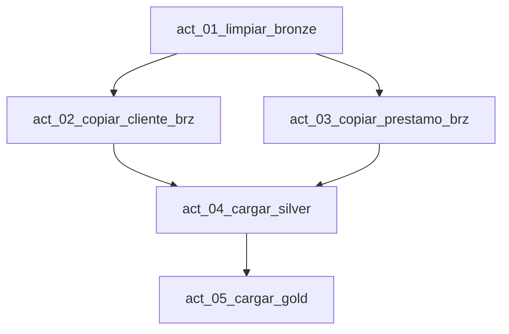

# Configuración del pipeline

Pipeline: `pl_banca_dev_lakehouse_warehouse`.

## Dependencias



## Actividades

### `act_01_limpiar_bronze`

| Propiedad | Valor |
|---|---|
| Tipo | Notebook |
| Notebook | `nb_banca_dev_limpiar_bronze` |
| Lenguaje | Spark SQL |
| Fuente | `sql/lakehouse/02_limpiar_bronze.sql` |

### `act_02_copiar_cliente_brz`

| Propiedad | Valor |
|---|---|
| Tipo | Copy Data |
| Origen | MySQL `banco_cliente` |
| Destino | Lakehouse `brz.banco_cliente` |
| Escritura | Insertar en tabla existente |

### `act_03_copiar_prestamo_brz`

| Propiedad | Valor |
|---|---|
| Tipo | Copy Data |
| Origen | MySQL `banco_prestamo` |
| Destino | Lakehouse `brz.banco_prestamo` |
| Escritura | Insertar en tabla existente |

### `act_04_cargar_silver`

| Propiedad | Valor |
|---|---|
| Tipo | Notebook |
| Notebook | `nb_banca_dev_cargar_silver` |
| Lenguaje | PySpark |
| Fuente | `notebooks/03_cargar_silver.py` |

Debe esperar a que finalicen ambas copias Bronze.

### `act_05_cargar_gold`

| Propiedad | Valor |
|---|---|
| Tipo | Stored procedure |
| Conexión | `wh_banca_dev_gold` |
| Procedimiento | `gld.usp_cargar_gold` |

El procedimiento orquestador ejecuta:

```text
usp_cargar_dim_cliente
usp_cargar_dim_tipo_prestamo
usp_cargar_fct_prestamo
```

No se requieren actividades Copy Data entre Silver y Gold.

## Resultado esperado

| Ejecución | Resultado |
|---|---|
| Inicial | Una versión actual por cliente y modelo Gold poblado |
| Con cambio | Nueva versión del cliente en Silver y Gold |
| Sin cambios | No aparecen versiones duplicadas |
