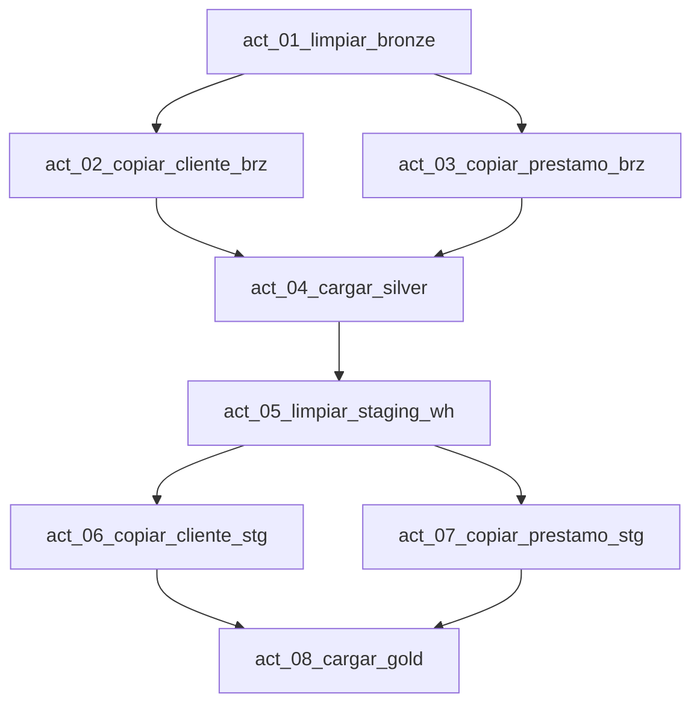

# Configuración del pipeline

Pipeline: `pl_banca_dev_lakehouse_warehouse`.

## Dependencias

Todas las dependencias deben configurarse con condición **Succeeded**.

## Actividades

### `act_01_limpiar_bronze`

| Propiedad | Valor |
|---|---|
| Tipo | Notebook |
| Notebook | `nb_banca_dev_limpiar_bronze` |
| Lakehouse | `lh_banca_dev_medallion` |
| Script | `sql/lakehouse/02_limpiar_bronze.sql` |

### `act_02_copiar_cliente_brz`

| Propiedad | Valor |
|---|---|
| Tipo | Copy Data |
| Origen | MySQL |
| Tabla origen | `banco_cliente` |
| Destino | Lakehouse |
| Tabla destino | `brz.banco_cliente` |
| Escritura | Insertar en tabla existente |

Verifica que las once columnas se mapeen a `STRING` en el destino.

### `act_03_copiar_prestamo_brz`

| Propiedad | Valor |
|---|---|
| Tipo | Copy Data |
| Origen | MySQL |
| Tabla origen | `banco_prestamo` |
| Destino | Lakehouse |
| Tabla destino | `brz.banco_prestamo` |
| Escritura | Insertar en tabla existente |

Verifica que las diez columnas se mapeen a `STRING` en el destino.

### `act_04_cargar_silver`

| Propiedad | Valor |
|---|---|
| Tipo | Notebook |
| Notebook | `nb_banca_dev_cargar_silver` |
| Lakehouse | `lh_banca_dev_medallion` |
| Script | `sql/lakehouse/03_cargar_silver.sql` |

Debe depender de las dos actividades Copy Data de Bronze.

### `act_05_limpiar_staging_wh`

| Propiedad | Valor |
|---|---|
| Tipo | Script |
| Conexión | `wh_banca_dev_gold` |
| Script | `sql/warehouse/02_limpiar_staging.sql` |

### `act_06_copiar_cliente_stg`

| Propiedad | Valor |
|---|---|
| Tipo | Copy Data |
| Origen | Lakehouse |
| Tabla origen | `slv.cliente` |
| Destino | Warehouse |
| Tabla destino | `stg.cliente` |
| Modo | Carga completa |

### `act_07_copiar_prestamo_stg`

| Propiedad | Valor |
|---|---|
| Tipo | Copy Data |
| Origen | Lakehouse |
| Tabla origen | `slv.prestamo` |
| Destino | Warehouse |
| Tabla destino | `stg.prestamo` |
| Modo | Carga completa |

### `act_08_cargar_gold`

| Propiedad | Valor |
|---|---|
| Tipo | Script |
| Conexión | `wh_banca_dev_gold` |
| Script | `sql/warehouse/03_cargar_gold.sql` |

Debe depender de las dos copias hacia staging.

## Comportamiento de las ejecuciones

| Ejecución | Resultado esperado |
|---|---|
| Primera | Una versión actual por cliente y todos los préstamos válidos |
| Segunda con cambio | Se cierra una versión y se crea otra para el cliente modificado |
| Tercera sin cambios | No aumenta el número de versiones |
