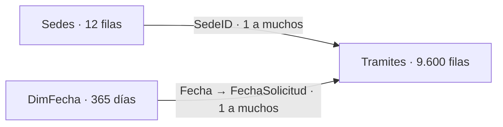

# Lab 09 — Power BI básico: pasaportes por sede

Sesión práctica de **90 minutos**, preparada para el **2 de octubre de 2026**. Importar dos Excel, limpiar con Power Query, relacionar tablas, crear una dimensión fecha y construir un informe de una página.

**Periodo:** 1 de octubre de 2025 al 30 de septiembre de 2026 (últimos 12 meses completos). **Corte:** 30/09/2026. Todo es simulado: sedes didácticas, ubicaciones aproximadas, cantidades e importe referencial. No incluye nombres, DNI ni números de pasaporte. Las sedes no son un directorio oficial.

## Material listo para clase

- [Guía del participante y solución](GUIA_PASO_A_PASO.md).
- [Guion del instructor: 90 minutos](GUIA_INSTRUCTOR.md).
- [Diccionario y reglas del dataset](DICCIONARIO_DATOS.md).
- [Excel de trámites](datos/01_tramites_pasaportes.xlsx): 9.624 filas de origen; 9.600 trámites después de quitar 24 duplicados.
- [Excel de sedes](datos/02_sedes.xlsx): 12 sedes con departamento, provincia, distrito, región natural y coordenadas.
- [Resultados esperados](datos/RESULTADOS_ESPERADOS.json).
- [Fórmulas DAX](dax/formulas.dax), consultas M de solución en `powerquery/`, [tema Power BI](tema_migraciones.json).
- [Imagen de referencia](imagenes/dashboard_referencia.png). Es una maqueta; los controles no son interactivos.

## Preparación

Power BI Desktop actualizado en un equipo Windows; Excel instalado no es necesario para importar los archivos. Copiar la carpeta completa a cada equipo. No hace falta publicar ni tener Power BI Pro para realizar el laboratorio local. Abrir primero los Excel si se desea comprobar los datos.

**PBIX:** este paquete no contiene un PBIX. El entorno de preparación es macOS y no dispone de Power BI Desktop ni un motor de modelado Power BI para compilar y verificar el archivo. La guía incluye la solución completa para construirlo y guardarlo en Desktop como `lab09_migraciones_pasaportes.pbix`. No se entrega un archivo renombrado artificialmente a PBIX.

## Modelo



Los filtros fluyen desde cada dimensión hacia los trámites. Un trámite representa una solicitud; `ENTREGADO` representa un pasaporte obtenido. El eje temporal principal es **fecha de solicitud**: los entregados de un mes son las solicitudes de ese mes que ya se entregaron al corte. No representa entregas ocurridas durante ese mes. Septiembre tiene menos entregados porque algunas solicitudes recientes siguen en proceso.

## Regeneración y validación

```bash
python3 scripts/generar_dataset.py
python3 scripts/validar_excel.py
```

Ejecutar desde esta carpeta. Python 3; no requiere instalar paquetes. La semilla es fija; regenerar reemplaza únicamente los dos Excel y los resultados esperados. Para compartir, usar el ZIP de lab09 ubicado junto a esta carpeta.

## Referencias oficiales

- [Instalar Power BI Desktop y requisitos](https://learn.microsoft.com/es-es/power-bi/fundamentals/desktop-get-the-desktop).
- [Relaciones del modelo](https://learn.microsoft.com/es-es/power-bi/transform-model/desktop-relationships-understand).
- [Tablas de fechas](https://learn.microsoft.com/es-es/power-bi/transform-model/desktop-date-tables).
- [Lenguaje M de Power Query](https://learn.microsoft.com/en-us/powerquery-m/).
